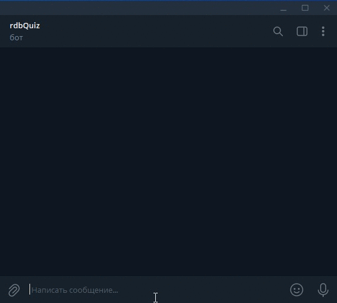

# Учебный проект [devman](dvmn.org) "Проводим викторину"

## Описание
В этом учебном проекте создаются Телеграм- и ВК-чатботы, организующие для пользователя викторину. 

### Пример диалога с ТГ-ботом


## Подготовительные действия
### Создайте чат-бота в Телеграм
Откройте диалог с [BotFather](https://t.me/BotFather) в Телеграм. Выполните команду `/newbot` и следуйте инструкции. 
Вам нужен `TG_TOKEN` нового бота.

### Создайте [группу](https://vk.com/groups?tab=admin) в ВК
Создайте ключ доступа: *Настройки - Работа с API - Ключи доступа* - кнопка **Создать ключ**.
Там же включите **Long Poll API** и дайте нужные права в *Настройки - Работа с API - LongPoll API - Типы событий*.

### Redis
Для хранения данных пользователя во время игры боты используют хранилище `Redis`. 
Можно использовать `RedisLab` или установить локальный сервер `redis` 
([вариант для Windows](https://github.com/zkteco-home/redis-windows.git)) 
`redis`. Для подключения к хранилищу `redis` ботам потребуется имя точки входа и пароль.

## Локальная установка без использования [Docker](https://www.docker.com/)
Для этого варианта использования ботов вам потребуются [Python3](python.org) и [GIT](https://git-scm.com/downloads). 

### 1. Откройте консоль
### 2. Скачайте проект
```shell
git clone https://github.com/redbor24/viktorina.git
cd viktorina
```
### 3. Установите зависимости
```shell
pip install -r requirements.txt
```

### 4. Задайте переменные окружения
Создайте файл `.env` со следующим содержимым:
```
TG_TOKEN=<ваш Телеграм-токен>
VK_TOKEN=<токен ВКонтакте>
REDIS_HOST=<имя точки входа redis>
REDIS_PORT=<порт для подклчения к redis>
REDIS_PASSWORD=<пароль для подклчения к redis>
```

## Запуск ботов
### Телеграм-бот
```shell
python tgbot.py
```

### Бот ВКонтакте
```shell
python VKbot.py
```

## Локальная установка с использованием [Docker](https://www.docker.com/)
Для этого варианта использования ботов вам [Docker CLI](https://www.docker.com/). 

### 1. Откройте консоль
### 2. Скачайте проект
```shell
git clone https://github.com/redbor24/viktorina.git
cd viktorina
```
### 3. Задайте переменные окружения
Создайте файл `.env` со следующим содержимым:
```
TG_TOKEN=<ваш Телеграм-токен>
VK_TOKEN=<токен ВКонтакте>
REDIS_HOST=<имя точки входа redis>
REDIS_PORT=<порт для подклчения к redis>
REDIS_PASSWORD=<пароль для подклчения к redis>
```
### 4. Выполните в консоли
```shell
docker build -t quiz-docker_local .
docker run -d quiz-docker_local
```

## Разворачивание ботов на [Heroku](https://heroku.com)
### 1. [Зарегистрируйтесь](https://id.heroku.com/login) на Heroku
### 2. Откройте консоль
### 3. Скачайте проект
```shell
git clone https://github.com/redbor24/viktorina.git
cd viktorina
```
### 4. Задайте переменные окружения
Создайте файл `.env` со следующим содержимым:
```
TG_TOKEN=<ваш Телеграм-токен>
VK_TOKEN=<токен ВКонтакте>
REDIS_HOST=<имя точки входа redis>
REDIS_PORT=<порт для подклчения к redis>
REDIS_PASSWORD=<пароль для подклчения к redis>
```
### 5. Выполните в консоли
```shell
heroku login -i
heroku container:login
heroku apps:create --region eu quiz-docker
heroku plugins:install heroku-config
heroku config:push -f .env -o
heroku container:push worker --app quiz-docker
heroku container:release worker --app quiz-docker
heroku ps:scale worker=1 --app quiz-docker
```
В процессе выполнения скрипта потребуется ввести email в качестве имени пользователя и пароль, указанные при регистрации
на [Heroku](https://heroku.com).

## Старт игры
### В Телеграм
Отправьте боты команду
```
/start
```
### В ВК
Отправьте боты команду
```
!игра
```

## Тестовые боты
Оба бота ([Телеграм](https://t.me/rdbQuiz_bot) и [ВК](https://vk.com/im?media=&sel=-216593240)) 
сейчас доступны для ознакомления.
